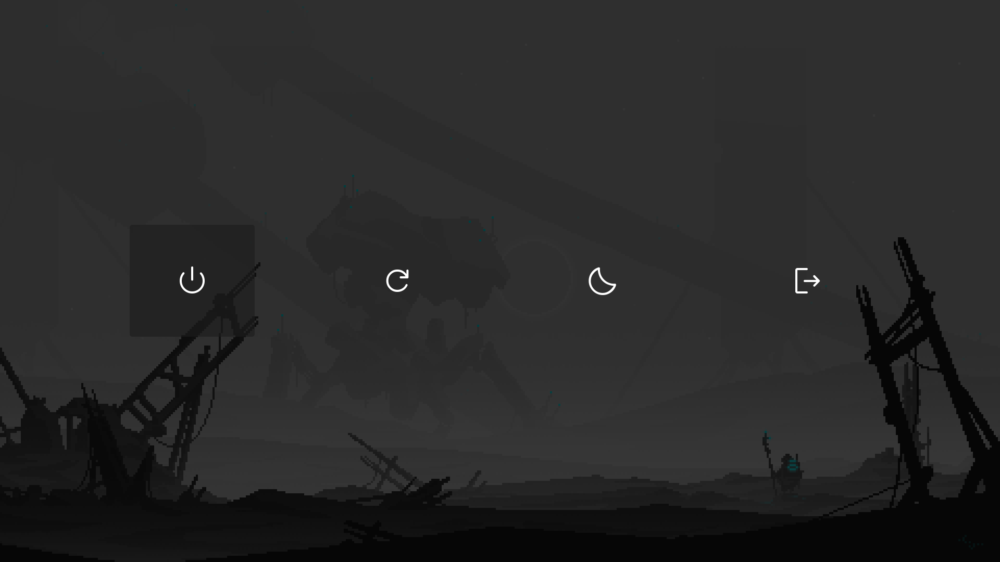

<h1 align="center">
  
  Niri Land
  
</h1>

<p align="center">
   <a href="#-features">Features</a> • 
   <a href="#-gallery">Gallery</a> • 
   <a href="#-dependencies">Dependencies</a> • 
   <a href="#-ui--icon-themes">UI & Icons</a> • 
   <a href="#%EF%B8%8F-installation--setup">Installation</a> • 
   <a href="#%EF%B8%8F-keybinds">Keybinds</a> • 
   <a href="#-optional-gtk-theme-font--icon-setup">GTK Setup</a> •
  <a href="#-roadmap">Roadmap</a>
</p>

## 🚀 Features 

- Gapless, borderless windows  
- Status bar hidden until overview  
- App drawer  
- Power menu  
- Volume flyout with mute indicator  
- Wallpaper selector  
- Status bar colored to wallpaper  
  
## 🖼 Gallery

| Background Selector |
|--------------------|
|  |

| Overview |
|---------|
|  |

| App Drawer |
|------------|
|  |

| Power Menu |
|-----------|
|  |


## 📦 Dependencies

| Name          | Used For                                    | Link                                                      |
| ------------- | ------------------------------------------- | --------------------------------------------------------- |
| `niri`        | Window manager                              | [niri](https://github.com/YaLTeR/niri)                    |
| `mako`        | Notifications, volume flyout                | [mako](https://github.com/emersion/mako)                  |
| `waybar`      | Overview bar                                | [waybar](https://github.com/Alexays/Waybar)               |
| `swww`        | Wallpaper daemon                            | [swww](https://github.com/Horus645/swww)                  |
| `rofi`        | Power menu, background selector, app drawer | [rofi](https://github.com/davatorium/rofi)                |
| `ImageMagick` | Background selector, status bar coloring    | [ImageMagick](https://github.com/ImageMagick/ImageMagick) |

## 🎨 UI & Icon Themes

| Name                       | Used For                 | Link                                                                                                 |
| -------------------------- | ------------------------ | ---------------------------------------------------------------------------------------------------- |
| `Bibata Classic`           | Cursor theme             | [Bibata Cursor](https://github.com/ful1e5/Bibata_Cursor)                                             |
| `JetBrains Mono Nerd Font` | UI font                  | [JetBrainsMono-NF](https://github.com/ryanoasis/nerd-fonts)                                          |
| `Material Symbols Rounded` | Power menu font          | [Material Symbols Rounded](https://github.com/google/material-design-icons/tree/master/variablefont) |
| `Papirus`                  | App drawer icons         | [Papirus](https://github.com/PapirusDevelopmentTeam/papirus-icon-theme)                              |

## 🛠️ Installation & Setup

> [!WARNING]  
> Tested only at `1080p` with `scale=1`. Other configurations may require adjusting **Rofi font size or padding** in `~/.config/rofi/themes/*`.


1. **Install dependencies** for your distribution.
2. **Configs**: Copy `.config` files to `~/.config`.
3. **Scripts**: Copy scripts from `bin` to `~/.local/bin`.
4. **Wallpapers**: Copy images from `wallpapers/` into `~/Pictures/wallpapers`.
5. **Autostart**: Link services with `niri` (preferred). This requires starting niri with `niri-session` or a display manager:

   ```bash
   systemctl --user add-wants niri.service mako.service
   systemctl --user add-wants niri.service waybar.service
   systemctl --user add-wants niri.service swww.service
   systemctl --user add-wants niri.service overviewlistener.service
   ```

   Alternatively, add these lines to `~/.config/niri/config.kdl`:

   ```kdl
   spawn-at-startup "waybar"
   spawn-at-startup "mako"
   spawn-at-startup "swww-daemon"
   spawn-at-startup "overviewlistener"
   ```

## ⌨️ Keybinds

| Action              | Shortcut  |
| ------------------- | --------- |
| Background selector | `Mod + B` |
| App drawer          | `Mod + D` |
| Power menu          | `Mod + P` |

## 🎭 Optional: GTK Theme, Font & Icon Setup

Enable dark mode and unify GTK apps (and some others like Firefox):

```bash
gsettings set org.gnome.desktop.interface color-scheme 'prefer-dark'
gsettings set org.gnome.desktop.interface gtk-theme 'Adwaita-dark'
gsettings set org.gnome.desktop.interface font-name 'JetBrains Mono Nerd Font 11'
gsettings set org.gnome.desktop.interface icon-theme 'Papirus'
```
## 📋 Roadmap
- [ ] Add confirmation boxes to power menu
- [ ] Create keybinds cheatsheet
- [ ] Create clipboard manager
- [ ] Improve status bar coloring logic
- [ ] Improve notification styling
- [ ] Improve window and menu animations
- [ ] Add idle management daemon
- [ ] Add blur effects to backgrounds
